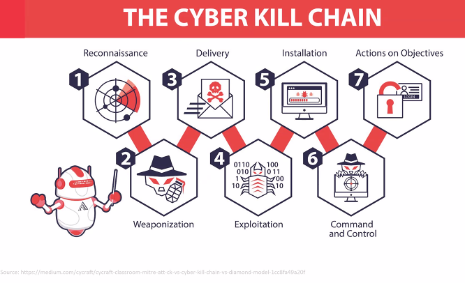

Greetings from De La Salle-College of Saint Benilde, School of Professional and Continuing Education.

Please find below the zoom details for the online session of M5S2 Governance, Risk Management and Cybersecurity Planning under Mr. Ricson Singson Que, on Saturday (April 12, 2025) from 8:00 am to 4:00 pm. 

Information Security Management
ISO:27001

Policy first before buy or to do anything.

# What is a Cybersecurity Policy?

- A **cybersecurity policy** is a clear set of rules and expectations that tell you what you **can and cannot do** when using an organization's systems, data, and technology.
- It’s meant to **protect the organization and its people** by setting boundaries on behavior, access, and responsibilities.

#

**Reference:** Cybersecurity Policies – Tips & Best Practices, 2024

#
CREATE A POWERPOINT TO PRESENT TO THE BOARD OR LEADER OF THE ORGANIZATION

#

# The Colors of Cybersecurity

- **White Team**: Management, Compliance, Analysis, Logistics (20%)
- **Yellow Team**: Software coders and architects (15%)
- **Orange Team**: Facilitates interaction and education (15%)
- **Red Team**: Offensive Security (15%)
- **Purple Team**: Integrates defensive tactics with offensive results (15%)
- **Blue Team**: Defensive Security (10%)
- **Green Team**: Enhances security automation with code and design (10%)

# What Is Governance, Risk, and Compliance?

- GRC management’s importance has been elevated in recent years as companies contend with increasingly intricate risks and regulations.
- **OCEG** (formerly the Open Compliance and Ethics Group) is credited with coining the GRC acronym in the early 2000s to synthesize a broad range of related activities.
- OCEG defines GRC as the **“integrated collection of capabilities that enable an organization to reliably achieve objectives, address uncertainty, and act with integrity.”**

# Why Is Governance, Risk, and Compliance Important for Companies?

- **Build efficiencies**: Standardized processes are easily repeatable. Individuals responsible for implementing GRC strategies know what is expected of them on a routine basis and can be more **productive and efficient** as a result.

- **Avoid duplication**: By developing a unified GRC strategy, leaders can be logical in assigning specific responsibilities. Departments are better equipped to **share resources and information**, and avoid wasted time duplicating tasks.

- **Cut costs**: An effective GRC strategy saves money on multiple fronts — through increased **operational efficiencies**, better allocation of resources, **eliminating duplicated efforts**, and **optimizing employees’ time**. Savings also come from proactively countering potential threats and avoiding/mitigating costly risks and regulatory fines.

#

# The Difference

## Governance (governing)
- Leads an organization by establishing what its goals are and what has to be achieved.
- Job of the governing body, e.g., board of directors/trustees or committee.
- Oversees management and the way they run the organization, not manage.

## Management (managing)
- Administers the day-to-day activities or operations of the organization to achieve the goals.
- Job of the management or executive team.
- Does its job in accordance with policy and resources.

#

# Effective Relationship

- Mutual respect for their separate but interdependent roles and responsibilities
- A clear definition of the results to be achieved
- Clearly defined and documented delegation and authority
- Mutual agreement about the boundaries of freedom granted to the chief executive to carry out his/her role and tasks
- A fair, ethical, and transparent process for evaluating the chief executive's performance

#

# Top Management Responsibility

A subset of enterprise governance that provides strategic direction, ensures organization objectives are achieved, manages risk and uses organizational resources responsibly and monitors the success or failure of the enterprise security program.

In order to establish successful information security governance, it requires:
- **Organizational Structure**
- **Assignment of roles and responsibilities**
- **Defined measurements of tasks**

#

# Security Management Structure

## Management to Operations Hierarchy

### Organizational
- **Security Policy**
- **Organizational Security**

### Technical
- **Asset Classification and Control**
- **Access Control**
- **Compliance**

### Physical
- **Personnel Security**
- **Physical & Environmental Security**

#

## Operations Level
- **System Development and Maintenance**
- **Communications and Operations Management**
- **Business Continuity Management**

#

## Chief Information Security Officer (CISO)

- A senior-level executive
- Responsible for developing and implementing an information security program
- Procedures and policies designed to protect enterprise communications, systems, and assets from both internal and external threats
- Conducts employee security awareness training
- Develops secure business and communication practices
- Identifying security objectives and metrics
- Choosing and purchasing security products from vendors
- Ensures that the company/agency is in regulatory compliance

#

# Risk Formula

**Risk = Likelihood × Impact**

### Breakdown:
1. **Likelihood**
   - Derived from:
     - **Threat** → **Exploits** → **Vulnerabilities**

2. **Impact**
   - Derived from:
     - **Causing** → **Business Impact**

3. **Result**
   - **Security Risk**

#

### Visual Structure:
- **Threat** → **Exploits** → **Vulnerabilities** → **Likelihood**
- **Likelihood × Impact = Risk**
- **Causing** → **Business Impact** → **Impact**
- **Impact** → **Security Risk**

#

# Factors for Risk to Exist

- Threat
- Vulnerability
- Probability or Frequency of Occurrence
- Impact
  - Monetary Loss or Expense
  - Reputational Loss
  - Physical (cause harm to personnel and bystanders)

#

# What is a Hazard?

- Often dictionaries combine it with the term "risk". For example, one dictionary defines hazard as **"a danger or risk"** which helps explain why many people use the terms interchangeably.

- The most common definition when talking about workplace health and safety is:
  - A **hazard** is any source of **potential damage, harm, or adverse health effects** on something or someone.
  - A hazard is the **potential for harm or an adverse effect** (for example, to people as health effects, to organizations as property or equipment losses, or to the environment).

- Sometimes the **resulting harm** is referred to as the **hazard instead** of the actual source of the hazard. For example, the disease tuberculosis (TB) might be called a "hazard" by some, but in general, the TB-causing bacteria (**Mycobacterium tuberculosis**) would be considered the "hazard" or **"hazardous biological agent"**.

#

# What is Hazard?

## Examples of Hazards and Their Effects

| Workplace Hazard | Example of Hazard               | Example of Harm Caused         |
|-------------------|---------------------------------|---------------------------------|
| Thing             | Knife                          | Cut                             |
| Substance         | Benzene                        | Leukemia                        |
| Material          | Mycobacterium tuberculosis     | Tuberculosis                    |
| Source of Energy  | Electricity                    | Shock, electrocution            |
| Condition         | Wet floor                      | Slips, falls                    |
| Process           | Welding                        | Metal fume fever                |
| Practice          | Hard rock mining               | Silicosis                       |
| Behavior          | Bullying                       | Anxiety, fear, depression       |

#

Hazard
 - Something that can potentially cause harm.
 - eg. pating ( okay lang )

 Risk
  - = hazard + exposure
  - eg. pating + lumapit ka sa pating

#

# What is a Risk Assessment?

- Risk assessment is the process where you:
  - Identify **hazards** and risk factors that have the **potential to cause harm** (hazard identification).
  - **Analyze and evaluate** the risk associated with that hazard (risk analysis, and risk evaluation).
  - Determine appropriate ways to **eliminate the hazard**, or **control the risk** when the hazard cannot be eliminated (risk control).

#

# Known Versus Unknown Risks

- Known risks are those which can be identified and analyzed beforehand in such a way as to be able to:
  a) Reduce the likelihood of their occurrence  
  b) Plan a risk response to reduce their impact in the event that they occur

#

# Types of Business Risk

- **Market Risk**: What happens when there is a substantial change in the particular marketplace in which a company competes.
- **Credit Risk**: When companies give their customers a line of credit; also, a company's risk of not having enough funds to pay its bills.
- **Liquidity Risk**: Refers to how easily a company can convert its assets into cash if it needs funds; it also refers to its daily cash flow.
- **Operational Risk**: Emerges as a result of a company's regular business activities and includes fraud, lawsuits, and personnel issues.

#

# Data and Information

## Agency Data

### Agency Information:
- Weapon inventory
- Military installations
- Military R&D
- Intelligence records
- Equipment specifications
- Building and installation plans
- Network diagrams
- Strategic and operational plans

### Personal Information:
- Staff biodata
- Soldier records
- Health records
- Guest information

---

## Circle Representation:
- **Blue Section**: Personal Data
- **Orange Section**: Corporate Data

#

# What is an Information Asset?

ISO 27001 defines an asset:
- **“Anything that has value to the organization.”** (ISO/IEC 27001:2005)
- Any **valuable location** within an organization's systems where **sensitive information** is stored, processed, or accessed.
- For example, an employee's computer, laptop, server, or company phone would be considered an asset. Likewise, sensitive information stored on those devices are assets.
- Because they are assets, they need to be managed and protected.

#

# Information Asset Register

- List at a high level of the "information" that you are wanting to protect.
- It is usually a list of critical information, personal information, and sensitive personal information.
- This includes also the hardware, software, and systems that you use to store, process, and manage them.
- In order to protect the asset, you need to also protect the container of the asset.
- It is best to identify the right information of your information assets. The information assets, including their location, owner, and value, are included in the register.

#

# Establishing Asset Types

- ISO 27001 suggests the following basic segregation of assets:
  - **Information assets**
  - **Supporting assets**:
    - Hardware
    - Software
    - People
    - Buildings
  - **Intangible assets** (e.g., brand and reputation)

  #

# A Simple BIA Form

| Business Process | IT System Required | Maximum Acceptable Outage | Materials/Records Required for Continued Operations | Potential Losses (Php) | Impact on Reputation (1-10)* |
|-------------------|--------------------|---------------------------|-----------------------------------------------------|-------------------------|-------------------------------|
|                   |                    |                           |                                                     |                         |                               |
|                   |                    |                           |                                                     |                         |                               |
|                   |                    |                           |                                                     |                         |                               |
|                   |                    |                           |                                                     |                         |                               |
|                   |                    |                           |                                                     |                         |                               |

*With 1 being the lowest and 10 being the highest rating

#

# Risk Assessment

- Involves the following tasks:
  - Determine the threats to critical processes/functions
  - Examine existing risk strategies/analysis
  - Apply scoring system to risks identified

#

# Threat Models

| Threat                  | Desired Security Property |
|-------------------------|---------------------------|
| **Spoofing**            | Authentication           |
| **Tampering**           | Integrity                |
| **Repudiation**         | Non-repudiation          |
| **Information Disclosure** | Confidentiality        |
| **Denial of Service**   | Availability             |
| **Elevation of Privilege** | Authorization          |

**Source**: Microsoft Security

#

References:

- https://www.nist.gov/itl/applied-cybersecurity/nice/nice-framework-resource-center/getting-started

- https://www.nist.gov/itl/applied-cybersecurity/nice/nice-framework-resource-center/nice-framework-current-versions

